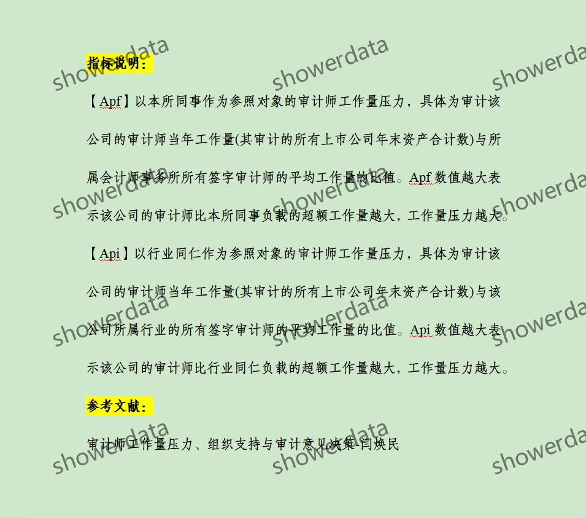
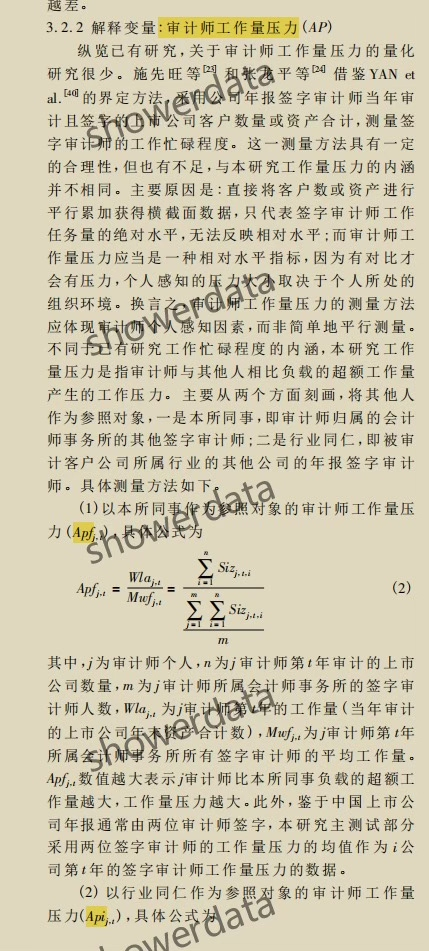
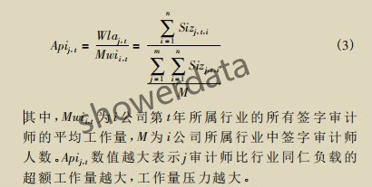
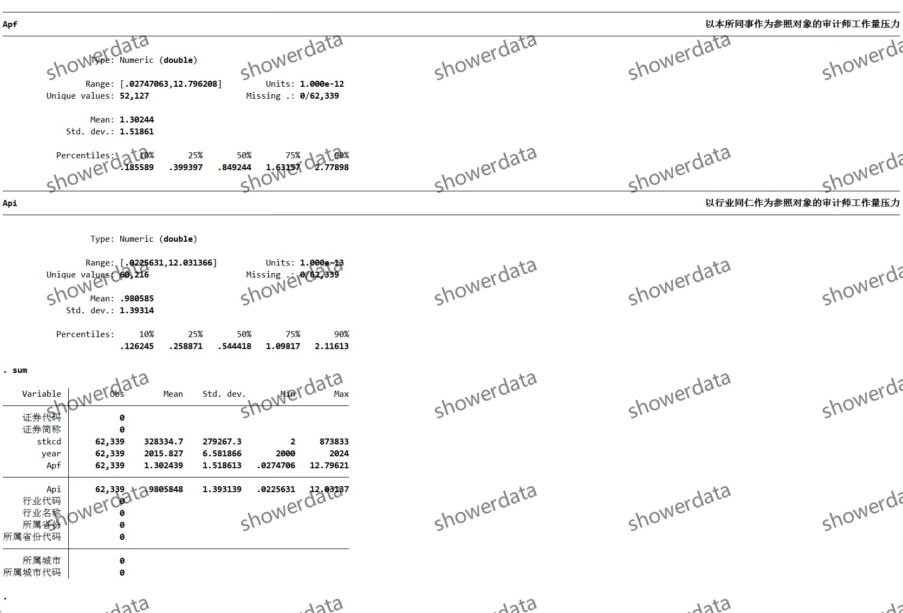
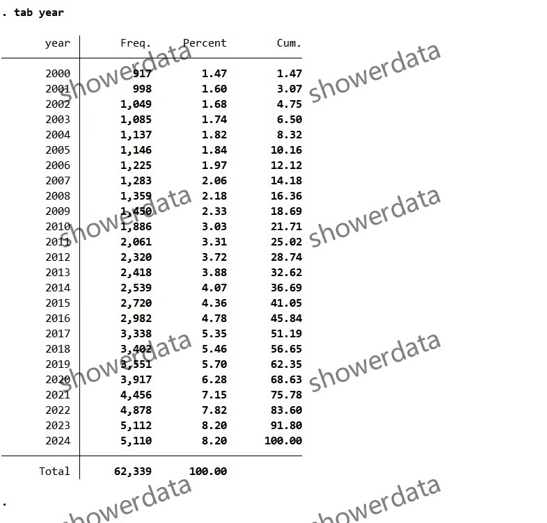
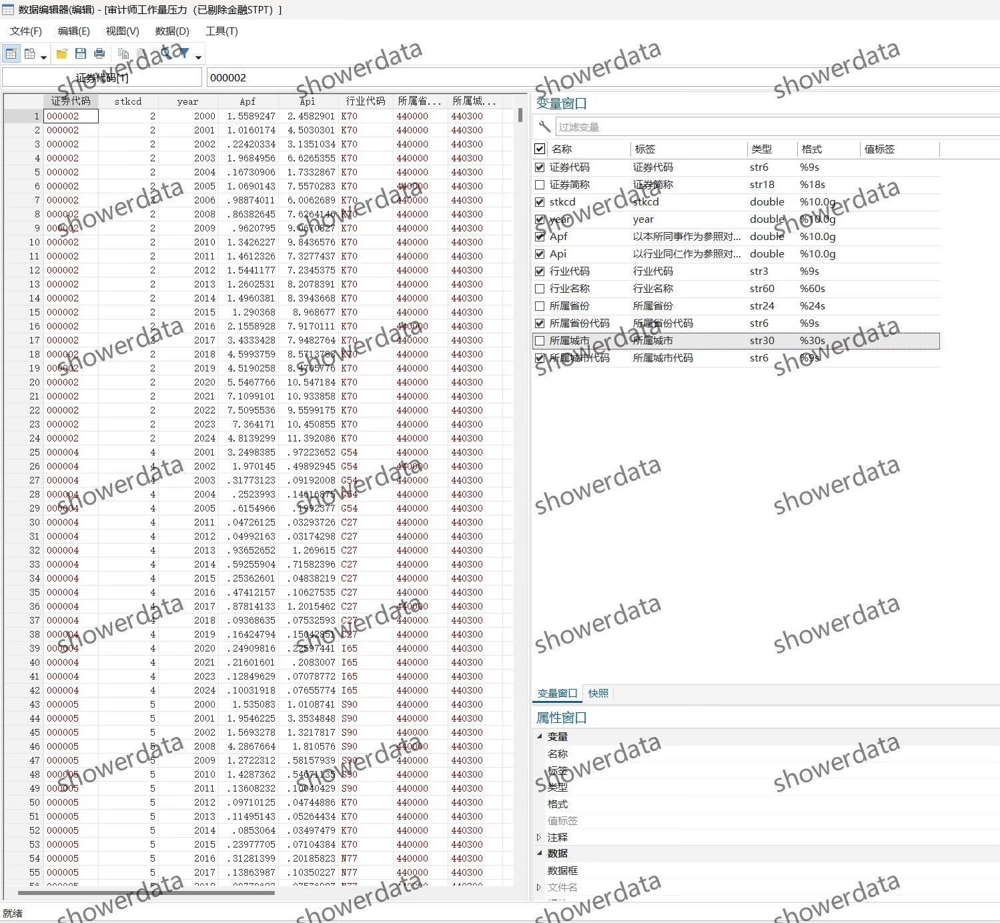
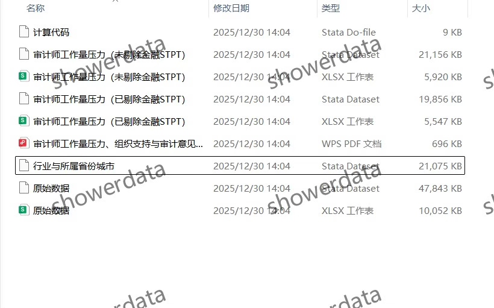

## Body

# 上市公司-审计师工作量压力（2000-2024年）

## 一、数据介绍

### 1. 数据详情
请查看下方图片以获取详细信息。在购买前，请确保您已清楚了解所有细节。一旦发货，将不接受任何理由的退货或换货。

### 2. 数据名称
上市公司-审计师工作量压力

### 3. 样本范围
本数据集包含A鼓尚视公司的数据，剔除了6.2万个观测值后的结果展示。

### 4. 时间范围
数据覆盖的时间范围为2000年至2024年。

### 5. 结果数据格式
结果数据将以Excel和Dta两种格式提供。

### 6. 数据内容
数据内容包括两个版本：已剔除和未剔除的结果、参考文献、代码以及原始数据。

## 二、数据结果指标

## 三、计算方法

## 四、参考文献

## Images

item_1009207812627

Here is a pay link on Stripe ( https://buy.stripe.com/3cs8yP7sY87d0vu9AB ). Please contact me lonlonago@foxmail.com after funding $89, and I will send you a complete data files , thank you!

